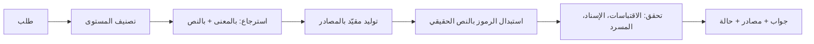

# منهل — The trust layer for Islamic AI

منهل محرك ذكاء اصطناعي إسلامي موثوق، يرتبط بأي مشروع بدل ما يبني أصحابه نموذجاً جديداً أو يستخدمون نموذجاً عاماً.
يسترجع من مصادر معتمدة، ويولّد مقيّداً بها، ويتحقق، ثم يرجع الجواب مع **المصدر** و**الحالة**:
مؤيَّد، أو يحتاج تحقق، أو إحالة للمختص.

> مشاركة في تحدي الذكاء الاصطناعي في خدمة المحتوى الإسلامي (باذل) — المسار 05.
> بداية البناء: 4 أكتوبر 2026. مبني على **المرجعية والحزمة العلمية** للتحدي: مستوياتها الأربعة، ومصادرها المعتمدة، ومعيارها العلمي الملزم.

## كيف يشتغل



**الضمان الأساسي:** المودل لا يكتب نص آية أو حديث أبداً. يكتب رمزاً مثل `{{quran:2:255}}` أو `{{hadith:bukhari:1}}`،
والكود يستبدله بالنص من قاعدة البيانات. وإذا كتب المودل اقتباساً بنفسه، يتحقق منه منهل، وإن لم يجده تنزل الحالة إلى «يحتاج تحقق».

| الحالة | المعنى |
|---|---|
| `supported` مؤيَّد | كل ما في الجواب مسند لمصادر منهل، وكل الفحوص نجحت |
| `needs_review` يحتاج تحقق | مصدر ناقص، أو اقتباس غير موجود، أو فحص فشل |
| `referral` إحالة للمختص | حالة شخصية، أو مسألة خلافية بلا مصادر كافية، أو سؤال خارج النطاق |
| `clarification` يحتاج توضيح | السؤال لا يُجاب بدون تفصيل ناقص؛ يرجع سؤال توضيح |

### مستويات المحتوى (من الحزمة العلمية للتحدي)

| المستوى | النطاق | كيف يتعامل منهل |
|---|---|---|
| **أ** معلومات أصلية مستقرة | القرآن، الحديث الصحيح، الأركان، السيرة الأساسية | إجابة مباشرة موثقة بالمصدر |
| **ب** شرح وتعريف واستدلال | المفاهيم، المقاصد، الشبهات العامة | من المصادر مع إظهار المرجع، وتجنب القطع فيما يحتمل الخلاف |
| **ج** خلافية أو عالية الحساسية | الخلاف الفقهي، العقدية التفصيلية | ما تنص عليه المصادر، أو بيان الخلاف بلا ترجيح، أو الإحالة |
| **د** فتوى أو حالة شخصية | واقعة فردية، صحة عقد أو عبادة لشخص | لا حكم مستقل: معلومة عامة + إحالة لجهة مؤهلة |

**خارج النطاق** (كما في الحزمة): الحكم على الأشخاص والجماعات، والنزاعات الخاصة ← إحالة مباشرة.
كل رد يحمل `disclosure` (الشفافية)، والحالات الشخصية لا يُحفظ نصها ([PRIVACY.md](PRIVACY.md)).

## التشغيل

المتطلبات: [Deno 2](https://deno.com)، و[Supabase CLI](https://supabase.com/docs/guides/cli)، ومشروع Supabase، ومفتاح OpenAI.

1. **الإعدادات:** انسخ `.env.example` إلى `.env` وعبّه. `DATABASE_URL` من Supabase > Connect > Session pooler.
2. **قاعدة البيانات:** شغّل `001_schema.sql` ثم `002_package_alignment.sql` من `supabase/migrations/` (أو `supabase db push`).
3. **القرآن:** نزّل ملف بيانات مصحف حفص (JSON) من [منصة المطورين في مجمع الملك فهد](https://qurancomplex.gov.sa/quran-dev)، ثم:
   `deno task import:quran --kfc path/to/hafs.json` — النص العثماني والإملائي من المجمع، والتفسير العربي وترجمات المعاني من QuranEnc.
4. **الحديث:** `deno task import:hadeethenc` — موسوعة الأحاديث النبوية بأحكامها وتخريجها وشروحها. وما لا يوجد محلياً (ومنه الصحيحان) يتحقق منه منهل مباشرة من الموسوعة الحديثية في الدرر السنية.
5. **البحث بالمعنى:** `deno task embed` (يكمل من حيث توقف؛ للتجربة: `--limit 500`).
6. **النشر:**
   ```bash
   supabase link --project-ref <ref>
   supabase secrets set OPENAI_API_KEY=... MANHAL_MODEL_GENERATE=gpt-6-astra MANHAL_MODEL_FAST=...
   deno task deploy
   ```
   `--no-verify-jwt` ضروري لأن منهل يستخدم مفاتيحه الخاصة. Supabase يعطي الدالة `SUPABASE_DB_URL` تلقائياً.
7. **مفتاح:** `deno task key --owner "اسم المنصة" --kind secret`
   للقوالب: `--kind public --domains example.com`
8. **جرّب:** `curl https://<ref>.supabase.co/functions/v1/manhal/v1/health`

محلياً: `deno task serve` يشغّل المحرك على `localhost:8000`.

## الاستخدام

الرابط الأساسي: `https://<ref>.supabase.co/functions/v1/manhal`

### متوافق مع OpenAI — غيّر سطرين فقط

```js
import OpenAI from "openai";

const manhal = new OpenAI({
  baseURL: "https://<ref>.supabase.co/functions/v1/manhal/v1",
  apiKey: "mh_sk_...",
});

const r = await manhal.chat.completions.create({
  model: "manhal",
  messages: [{ role: "user", content: "ما فضل الصدقة؟" }],
});
console.log(r.choices[0].message.content); // الجواب
console.log(r.manhal.status, r.manhal.sources); // الحالة والمصادر
```

| `model` | القدرة |
|---|---|
| `manhal` / `manhal-ask` | سؤال وجواب مسند |
| `manhal-verify` | التحقق من رسالة (حديث، آية، قول منسوب) |
| `manhal-translate` | ترجمة، والآيات من الترجمة المعتمدة (`target_lang` في الطلب) |
| `manhal-guard` | أرسل المحادثة كما هي، ومنهل يراجع آخر جواب من نموذجك |
| `manhal-generate` | مخطط خطبة أو درس بأدلته |

### نقاط مباشرة

```bash
curl $URL/v1/verify -H "Authorization: Bearer mh_sk_..." \
  -d '{"text": "اطلبوا العلم ولو في الصين"}'
```

| النقطة | المدخلات |
|---|---|
| `POST /v1/ask` | `question`، `lang`؟، `audience`؟ (`general`، `new_to_islam`، `non_muslim`، `child`، `student`) |
| `POST /v1/verify` | `text`، `lang`؟ |
| `POST /v1/translate` | `text`، `target_lang` |
| `POST /v1/guard` | `question`، `answer`، `lang`؟ |
| `POST /v1/generate` | `topic`، `lang`؟ |
| `GET /v1/models` | — |

### شكل الرد

```json
{
  "id": "…",
  "capability": "verify",
  "answer": "1. «إنما الأعمال بالنيات…»\nالحديث موجود في صحيح البخاري، 1، وحكمه: صحيح…",
  "status": "supported",
  "status_label": "مؤيَّد",
  "sources": [{ "sid": "S1", "type": "hadith", "ref": "bukhari:1", "title": "صحيح البخاري، 1", "text": "…", "grades": [] }],
  "checks": [{ "name": "claims_sourced", "ok": true }],
  "claims": [{ "type": "hadith", "verdict": "authentic", "message": "…" }]
}
```

كل جواب يُحفظ برقمه (`id`) مع مصادره في جدول `requests` للمراجعة.

## المصادر

**كل مصادر المحتوى من المرجعية والحزمة العلمية للتحدي فقط**: مصحف مجمع الملك فهد، وترجمات وتفاسير QuranEnc، وموسوعة الأحاديث النبوية HadeethEnc، والموسوعة الحديثية في الدرر السنية للتحقق، والمسرد المبني على نماذج قاموس الحزمة وموسوعة المصطلحات.
التفاصيل وطريقة الاستخدام والتحقق والشروط لكل مصدر في **[SOURCES.md](SOURCES.md)**.

## الاختبار

- `deno task test` — اختبارات الوحدة.
- `deno task eval --cases eval/cases.package.json` — يشغّل أمثلة أسئلة الاختبار من الحزمة العلمية (12 حالة) وحالات منهل، 3 مرات لكل حالة، ويقارن منهل مع نفس المودل بدونه، ويطلع CSV يعبّيه المتخصص الشرعي.
  للاختبار الكامل: أكمل الحالات المئة في `eval/cases.json` بنفس الشكل.
- `tests/mock-openai.ts` — خادم OpenAI وهمي لتجربة المحرك كاملاً بدون تكلفة.

## حدود معروفة

- **حديث غير موجود في القاعدة** يُقال عنه «لم نجده» لا «موضوع». منهل لا يحكم بدون مصدر.
- **التحقق حرفي لا بالتشابه:** الآية تُعتبر مطابقة فقط إذا طابقت نص المصحف حرفياً بعد توحيد الإملاء (وقد تمتد على حتى 7 آيات متتالية)، والحديث لا يُثبت صحيحاً إلا بلفظه. اللفظ القريب يرجع «يحتاج تحقق» مع النص الصحيح وحكمه.
- **النص الأقصر من 3 كلمات** لا يُحكم عليه (إلا إذا كان آية كاملة مثل ﴿قل هو الله أحد﴾).
- **انقطاع الدرر السنية** يظهر في الفحوص (`dorar_reachable`)، ولا يُقال عن الحديث «لم نجده» وهو لم يُبحث فيه أصلاً.
- **نص الحديث** يُعرض بإسناده كما في المصدر.
- **الترجمات الإنجليزية للحديث** غير صالحة للاستخدام التجاري؛ البديل HadeethEnc.

## البنية

```
supabase/
  migrations/001_schema.sql     قاعدة البيانات ودوال البحث
  functions/manhal/
    index.ts                    التوجيه، المفاتيح، السجل
    lib/capabilities.ts         ask, verify, translate, guard, generate
    lib/finalize.ts             استبدال الرموز + الفحوص + الحالة
    lib/resolve.ts              الرموز ← النص الحقيقي
    lib/checks.ts               فحص الاقتباسات والإسناد
    lib/glossary.ts             المسرد
    lib/dorar.ts                التحقق عبر الموسوعة الحديثية (الدرر السنية)
    lib/openai-compat.ts        صيغة OpenAI
    lib/prompts.ts              تعليمات المودل
scripts/                        السحب، الـ embeddings، المفاتيح، الاختبار
data/glossary.json              المسرد (بعد التعديل: deno task glossary)
```
