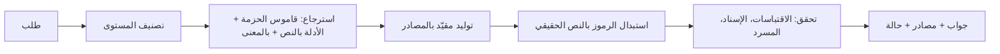

# منهل — طبقة الذكاء الاصطناعي الإسلامية

**The trust layer for Islamic AI**

> مشاركة في **تحدي الذكاء الاصطناعي في خدمة المحتوى الإسلامي** (باذل) — المسار 05 المفتوح.
> مبني على **المرجعية والحزمة العلمية** للتحدي: مستوياتها الأربعة، ومصادرها المعتمدة، ومعيارها العلمي الملزم.

## جرّب منهل

| | |
|---|---|
| **منهل تشات + الربط + القوالب** (الواجهة) | [1manhal.com](https://1manhal.com) |
| **الـ API** (المحرك) | `https://midmkzolahrdtzswqqer.supabase.co/functions/v1/manhal` — فحص الحالة: [`/v1/health`](https://midmkzolahrdtzswqqer.supabase.co/functions/v1/manhal/v1/health) |

**للجنة التحكيم:** نسخة البداية موثقة بالـ tag [`v0-start`](https://github.com/feellikeduck/manhal/releases/tag/v0-start) على أول commit (`start: hackathon baseline (4 Oct 2026)`)، وكل ما بعده بُني من 4 إلى 6 أكتوبر 2026. هذا المستودع هو **المحرك** (الـ API)، والواجهة (منهل تشات، والربط، والقوالب، وصفحة المختصين) مبنية في Lovable فوق نفس المحرك وقاعدته.

---

**منهل هو طبقة الذكاء الاصطناعي الإسلامية.**

ومن منهل تبدأ وتتطور جميع المشاريع المساهمة في نشر الإسلام وتعريف الناس به.

كل مشروع جديد يحتاج إلى ذكاء اصطناعي يفهم الدين، ويعرف كيف يتعامل مع المحتوى الإسلامي: لا يحرّف الآيات، ولا ينسب إلى النبي ﷺ ما لم يثبت، ولا يُفتي في مسائل تحتاج إلى مختص.

**ومن هنا يأتي منهل.**

منهل طبقة تضعها فوق ذكائك الاصطناعي، فتضيف إليه المعرفة الإسلامية الموثوقة، والتحقق، والمصادر، والقدرة على التعامل مع المحتوى الإسلامي كما ينبغي.

**الذكاء الاصطناعي يجيب، ومنهل يتحقق ويوثق ويحمي.**

### مع منهل

* **تسأل،** فيجيبك من مصادر موثوقة، ومع كل جواب مصدره وحالته: مؤيَّد، أو يحتاج تحقق، أو إحالة للمختص.
* **تتحقق** من الأحاديث والرسائل الإسلامية المنتشرة، فتعرف صحتها ومصدرها وحكم أهل العلم فيها.
* **تترجم** المحتوى الإسلامي، فتأتي الآيات من الترجمات المعتمدة لا من ترجمة آلية.
* **وتختار** ما تريد من منهل أثناء المحادثة، بحسب حاجتك.

وإن كان في منصتك نموذج ذكاء اصطناعي، فلا حاجة إلى استبداله. **منهل يستطيع أن يكون حارساً فوقه.**

### لمنهل وضعان

**منهل الكامل — المحرك:** يصبح منهل محرك الذكاء الإسلامي في منصتك، من السؤال والجواب إلى التحقق والترجمة. وتنتقل منصتك إليه بتغيير سطرين في الكود، لأنه متوافق مع الصيغة التي تعمل بها منصات الذكاء الاصطناعي اليوم.

**منهل الحارس — بوابة التفتيش:** تبقى منصتك على نموذجها، أيّاً كان، ويقف منهل بينه وبين المستخدم. يراجع كل جواب قبل أن يصل: إن كان سليماً مرّ، وإن كان فيه خطأ، كآية محرّفة أو حديث لا يثبت أو مصطلح في غير موضعه، كشفه وقدّم الجواب الصحيح بمصادره. **المستخدم لا يشعر بشيء، لكن الخطأ لا يصل إليه.**

### منهل يبدأ من الآن

أي مشروع جديد يريد الذكاء الاصطناعي في مجال إسلامي يستطيع أن يبدأ من منهل: المصادر الموثقة، والتحقق، والترجمة، والحماية، والإحالة. كلها جاهزة تحت يده، وما يبنيه فوقها يبقى مشروعه هو.

لكن دور منهل لا يتوقف عند المشاريع الإسلامية. عبر **قوالب منهل** تضع أي شركة محادثة منهل في موقعها بسطر واحد، بلونها وشعارها، وأولها **قالب التعريف بالإسلام**. فلا ننتظر غير المسلم أن يبحث عن منصة إسلامية، بل نوصل المعرفة إليه حيث هو. **منهل لا ينتظر المستخدم، بل يصل إليه.**

### قلب منهل

* **النص الشرعي لا يكتبه النموذج أبداً.** الآية والحديث يُجلبان حرفياً من المصادر المعتمدة، ويُطابَق كل اقتباس حرفاً بحرف، فالآية المحرّفة تنكشف ولو تغيّرت فيها كلمة واحدة.
* **مصادره هي مصادر الحزمة العلمية للتحدي:** مصحف مجمع الملك فهد، وموسوعة القرآن الكريم، وموسوعة الأحاديث النبوية، والدرر السنية، وقاموس المصطلحات المعتمد ([SOURCES.md](SOURCES.md)).
* **الحكم على الجواب للكود لا للنموذج.** النموذج يفهم ويصوغ، والمحرك يتحقق ويقرر الحالة.
* **يعرف حدوده:** يجيب في المستقر موثقاً، ويعرض الخلاف دون ترجيح، ولا يفتي في الحالات الشخصية بل يحيلها.
* **مستقل عن النموذج:** صُمّم ليعمل فوق أي نموذج يدعم صيغة OpenAI؛ النموذج اسم في الإعدادات. النسخة المنشورة تعمل على GPT-6 Astra.

### كيف يتطور منهل؟

ما لا يملك منهل له إجابة موثوقة لا يجيب عنه من عنده، بل ينتقل، **بموافقة السائل**، إلى صفحة المختصين. يجيب المفتي الموثّق بعد دقيقة أو ساعة أو أيام، فيصل إلى السائل إشعار بالإجابة مع اسم المختص ومراجعه. وتُحفظ الإجابات العامة الموثقة في طبقة مستقلة عن مصادر الحزمة، أما الحالات الشخصية فتبقى لأصحابها. **كل سؤال لا يعرفه منهل اليوم قد يصبح سؤالاً يعرف إجابته غداً.**

### لماذا منهل؟

بدل أن يبني كل مشروع قاعدة معرفة، ونظام تحقق، ومترجماً، وحارساً، ونظاماً للإحالة إلى المختصين… **يبني فوق منهل.**

منهل ليس مشروعاً واحداً. **منهل هو أساس المشاريع الإسلامية.** ومن منهلٍ واحد، تتفرّع منظومة كاملة.

**منهل — أساس الذكاء الاصطناعي الإسلامي.**

---

## كيف يشتغل



**الاسترجاع بثلاث طبقات:** (1) تعريفات قاموس المصطلحات في الحزمة إذا ورد المصطلح في السؤال، (2) الأدلة المشهورة: النموذج يقترح ألفاظها، والكود يبحث عنها **حرفياً** في القاعدة ولا يدخل إلا الموجود فعلاً، (3) الأقرب بالمعنى (embeddings).

**الضمان الأساسي:** المودل لا يكتب نص آية أو حديث أبداً. يكتب رمزاً مثل `{{quran:2:255}}` أو `{{hadith:hadeethenc:66511}}`،
والكود يستبدله بالنص من قاعدة البيانات. وإذا كتب المودل اقتباساً بنفسه، يتحقق منه منهل، وإن لم يجده تنزل الحالة إلى «يحتاج تحقق».

| الحالة | المعنى |
|---|---|
| `supported` مؤيَّد | كل ما في الجواب مسند لمصادر منهل، وكل الفحوص نجحت |
| `needs_review` يحتاج تحقق | مصدر ناقص، أو اقتباس غير موجود، أو فحص فشل |
| `referral` إحالة للمختص | حالة شخصية، أو مسألة خلافية بلا مصادر كافية، أو سؤال خارج النطاق |
| `clarification` يحتاج توضيح | السؤال لا يُجاب بدون تفصيل ناقص؛ يرجع سؤال توضيح |

### مستويات المحتوى (من الحزمة العلمية للتحدي)

| المستوى | النطاق | كيف يتعامل منهل |
|---|---|---|
| **أ** معلومات أصلية مستقرة | القرآن، الحديث الصحيح، الأركان، السيرة الأساسية | إجابة مباشرة موثقة بالمصدر |
| **ب** شرح وتعريف واستدلال | المفاهيم، المقاصد، الشبهات العامة | من المصادر مع إظهار المرجع، وتجنب القطع فيما يحتمل الخلاف |
| **ج** خلافية أو عالية الحساسية | الخلاف الفقهي، العقدية التفصيلية | ما تنص عليه المصادر، أو بيان الخلاف بلا ترجيح، أو الإحالة |
| **د** فتوى أو حالة شخصية | واقعة فردية، صحة عقد أو عبادة لشخص | لا حكم مستقل: معلومة عامة + إحالة لجهة مؤهلة |

**خارج النطاق** (كما في الحزمة): الحكم على الأشخاص والجماعات، والنزاعات الخاصة ← إحالة مباشرة.
كل رد يحمل `disclosure` (الشفافية)، والحالات الشخصية لا يُحفظ نصها ([PRIVACY.md](PRIVACY.md)).

## التشغيل

المتطلبات: [Deno 2](https://deno.com)، و[Supabase CLI](https://supabase.com/docs/guides/cli)، ومشروع Supabase، ومفتاح OpenAI.

1. **الإعدادات:** انسخ `.env.example` إلى `.env` وعبّه. `DATABASE_URL` من Supabase > Connect > Session pooler.
2. **قاعدة البيانات:** شغّل `001_schema.sql` ثم `002_package_alignment.sql` من `supabase/migrations/` (أو `supabase db push`).
3. **القرآن:** نزّل ملف بيانات مصحف حفص (JSON) من [منصة المطورين في مجمع الملك فهد](https://qurancomplex.gov.sa/quran-dev)، ثم:
   `deno task import:quran --kfc path/to/hafs.json` — النص العثماني والإملائي من المجمع (يدعم نسخة v30 بحقل `aya_text_unicode`)، وترجمات المعاني من QuranEnc، والتفسير العربي بإضافة `--tafsir <key>`.
4. **الحديث:** `deno task import:hadeethenc` — موسوعة الأحاديث النبوية بأحكامها وتخريجها وشروحها. وما لا يوجد محلياً (ومنه الصحيحان) يتحقق منه منهل مباشرة من الموسوعة الحديثية في الدرر السنية.
5. **البحث بالمعنى:** `deno task embed` (يكمل من حيث توقف؛ للتجربة: `--limit 500`).
6. **النشر:**
   ```bash
   supabase login
   supabase secrets set OPENAI_API_KEY=... --project-ref <ref>
   supabase functions deploy manhal --no-verify-jwt --use-api --project-ref <ref>
   ```
   (على ويندوز: `npx.cmd supabase ...`). النموذج الافتراضي `gpt-6-astra`، ويتغير بـ `MANHAL_MODEL_GENERATE` و`MANHAL_MODEL_FAST` و`OPENAI_BASE_URL`.
   `--no-verify-jwt` ضروري لأن منهل يستخدم مفاتيحه الخاصة. Supabase يعطي الدالة `SUPABASE_DB_URL` تلقائياً.
7. **مفتاح:** `deno task key --owner "اسم المنصة" --kind secret`
   للقوالب: `--kind public --domains example.com`
8. **جرّب:** `curl https://<ref>.supabase.co/functions/v1/manhal/v1/health`، ثم أضف `MANHAL_API_URL` و`MANHAL_TEST_KEY` في `.env` وشغّل `deno run -A --env-file=.env scripts/smoke.ts` (4 حالات من الحزمة: آية صحيحة، آية محرّفة، حديث لا يثبت، حالة شخصية).

محلياً: `deno task serve` يشغّل المحرك على `localhost:8000`.

## الاستخدام

الرابط الأساسي: `https://<ref>.supabase.co/functions/v1/manhal`

### متوافق مع OpenAI — غيّر سطرين فقط

```js
import OpenAI from "openai";

const manhal = new OpenAI({
  baseURL: "https://<ref>.supabase.co/functions/v1/manhal/v1",
  apiKey: "mh_sk_...",
});

const r = await manhal.chat.completions.create({
  model: "manhal",
  messages: [{ role: "user", content: "ما فضل الصدقة؟" }],
});
console.log(r.choices[0].message.content); // الجواب
console.log(r.manhal.status, r.manhal.sources); // الحالة والمصادر
```

| `model` | القدرة |
|---|---|
| `manhal` / `manhal-ask` | سؤال وجواب مسند |
| `manhal-verify` | التحقق من رسالة (حديث، آية، قول منسوب) |
| `manhal-translate` | ترجمة، والآيات من الترجمة المعتمدة (`target_lang` في الطلب) |
| `manhal-guard` | أرسل المحادثة كما هي، ومنهل يراجع آخر جواب من نموذجك |
| `manhal-generate` | مخطط خطبة أو درس بأدلته |

### نقاط مباشرة

```bash
curl $URL/v1/verify -H "Authorization: Bearer mh_sk_..." \
  -d '{"text": "اطلبوا العلم ولو في الصين"}'
```

| النقطة | المدخلات |
|---|---|
| `POST /v1/ask` | `question`، `lang`؟، `audience`؟ (`general`، `new_to_islam`، `non_muslim`، `child`، `student`) |
| `POST /v1/verify` | `text`، `lang`؟ |
| `POST /v1/translate` | `text`، `target_lang` |
| `POST /v1/guard` | `question`، `answer`، `lang`؟ |
| `POST /v1/generate` | `topic`، `lang`؟ |
| `GET /v1/models` | — |

### شكل الرد

```json
{
  "id": "…",
  "capability": "verify",
  "answer": "1. «إنما الأعمال بالنيات…»\nالحديث موجود في موسوعة الأحاديث النبوية، وحكمه: صحيح…",
  "status": "supported",
  "status_label": "مؤيَّد",
  "sources": [{ "sid": "S1", "type": "hadith", "ref": "hadeethenc:66511", "title": "متفق عليه — موسوعة الأحاديث النبوية", "text": "…", "grades": [] }],
  "checks": [{ "name": "claims_sourced", "ok": true }],
  "claims": [{ "type": "hadith", "verdict": "authentic", "message": "…" }]
}
```

كل جواب يُحفظ برقمه (`id`) مع مصادره في جدول `requests` للمراجعة.

## المصادر

**كل مصادر المحتوى من المرجعية والحزمة العلمية للتحدي فقط**: مصحف مجمع الملك فهد، وترجمات وتفاسير QuranEnc، وموسوعة الأحاديث النبوية HadeethEnc، والموسوعة الحديثية في الدرر السنية للتحقق، والمسرد المبني على نماذج قاموس الحزمة وموسوعة المصطلحات.
التفاصيل وطريقة الاستخدام والتحقق والشروط لكل مصدر في **[SOURCES.md](SOURCES.md)**.

## الاختبار

- `deno task test` — اختبارات الوحدة.
- `deno task eval --cases eval/cases.package.json` — يشغّل أمثلة أسئلة الاختبار من الحزمة العلمية (12 حالة) وحالات منهل، 3 مرات لكل حالة، ويقارن منهل مع نفس المودل بدونه، ويطلع CSV يعبّيه المتخصص الشرعي.
  للاختبار الكامل: أكمل الحالات المئة في `eval/cases.json` بنفس الشكل.
- `tests/mock-openai.ts` — خادم OpenAI وهمي لتجربة المحرك كاملاً بدون تكلفة.

## حدود معروفة

- **لا مصادر فقه أو فتاوى بعد:** المسائل الفقهية التفصيلية التي لا تنص عليها الآيات والأحاديث في القاعدة يحيلها منهل بدل أن يجيب من عنده. ربط مصادر الفقه المذكورة في الحزمة هو المرحلة القادمة.
- **الاستشهاد:** الكود يتحقق من أن كل `[S#]` مصدر أُعطي للنموذج فعلاً، وأن كل نص شرعي حرفي من القاعدة. أما مطابقة معنى الجملة لمصدرها فتقيسها مجموعة الاختبار والمراجعة الشرعية.
- **الترجمة المعتمدة المستوردة حالياً:** الإنجليزية (Saheeh International). اللغات الأخرى تُعلَّم آياتها «يحتاج تحقق».

- **حديث غير موجود في القاعدة** يُقال عنه «لم نجده» لا «موضوع». منهل لا يحكم بدون مصدر.
- **التحقق حرفي لا بالتشابه:** الآية تُعتبر مطابقة فقط إذا طابقت نص المصحف حرفياً بعد توحيد الإملاء (وقد تمتد على حتى 7 آيات متتالية)، والحديث لا يُثبت صحيحاً إلا بلفظه. اللفظ القريب يرجع «يحتاج تحقق» مع النص الصحيح وحكمه.
- **النص الأقصر من 3 كلمات** لا يُحكم عليه (إلا إذا كان آية كاملة مثل ﴿قل هو الله أحد﴾).
- **انقطاع الدرر السنية** يظهر في الفحوص (`dorar_reachable`)، ولا يُقال عن الحديث «لم نجده» وهو لم يُبحث فيه أصلاً.
- **نص الحديث** يُعرض بإسناده كما في المصدر.
- **الترجمات الإنجليزية للحديث** غير صالحة للاستخدام التجاري؛ البديل HadeethEnc.

## البنية

```
supabase/
  migrations/001_schema.sql     قاعدة البيانات ودوال البحث
  migrations/003_purge_schedule.sql  الحذف التلقائي للسجل بعد 30 يوماً
  functions/manhal/
    index.ts                    التوجيه، المفاتيح، السجل
    lib/capabilities.ts         ask, verify, translate, guard, generate
    lib/finalize.ts             استبدال الرموز + الفحوص + الحالة
    lib/resolve.ts              الرموز ← النص الحقيقي
    lib/checks.ts               فحص الاقتباسات والإسناد
    lib/glossary.ts             المسرد
    lib/package-terms.ts        تعريفات قاموس المصطلحات في الحزمة كمصادر
    lib/sources.ts              الاسترجاع (بالمعنى + بالنص) وتحميل المصادر
    lib/dorar.ts                التحقق عبر الموسوعة الحديثية (الدرر السنية)
    lib/openai-compat.ts        صيغة OpenAI
    lib/prompts.ts              تعليمات المودل
scripts/                        السحب، الـ embeddings، المفاتيح، الاختبار
data/glossary.json              المسرد (بعد التعديل: deno task glossary)
```
